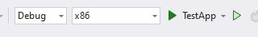

# C++ Desktopentwicklung aktivieren

**Hinweis:** Dazu nutzt man den `Visual Studio Installer`. Dieser sollte mit installiert worden sein beim Installieren von VS.

# Repo auschecken

Bitte das Repository https://github.com/gabbersepp/profiler-workshop auschecken und in das Verzeichnis `code\1-start-projekt` wechseln.

# Projekte kompilieren

Sowohl `TestApp.sln` als auch `ProfilerWorkshop.sln` öffnen, als Plattform jeweils x86 auswählen und dann kompilieren.

**TestApp:**

**ProfilerWorkshop:**

# Starten

`start.bat` ausführen. Es sollte `constructorinitHello, World!` in der Konsole erscheinen