# .NET (Core) Profiler Workshop

Josef Biehler

---

# Über mich
- Seit 2011 bei der Samhammer AG als Fullstack Entwickler
- biehler-josef.de
- github.com/gabbersepp
- dev.to/gabbersepp
- gabbersepp@googlemail.com
- Workshop: https://github.com/gabbersepp/profiler-workshop

---

# Agenda
- Aufbau des Startprojekts (damit man weis wie es geht)
- Basiswissen
- Einen Profiler debuggen
- Mehr Informationen rausholen
- diverse Exkurse
- FunctionEnter/FunctionLeave 32Bit
- FunctionEnter/FunctionLeave 64Bit
- Funktionsparameter auslesen
- Stackoverflow erkennen

<!--
Wieso macht man das?
Wollte eigenen Profiler für App.
aber dann Cluster umzug Blablabla
-->

---
# Startprojekt
- C++ in VS integrieren
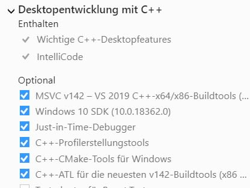

<!--
ich zeige das Einrichten eines leeren profiler projektes.
Teilnehmer schauen nur zu

-->

---
# Startprojekt
- Neues Projekt `ATL` mit Standardeinstellungen
- Name: ProfilerWorkshop
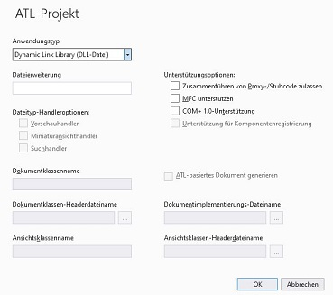

---
# Startprojekt
- `ProfilerWorkshopPS` Projekt: Keine Ahnung für was das benutzt wird. Einfach löschen
- Kein automatisches Registrieren der DLL
- Zusätzliche Abhängigkeiten
- muss für x86 und x64 gemacht werden!
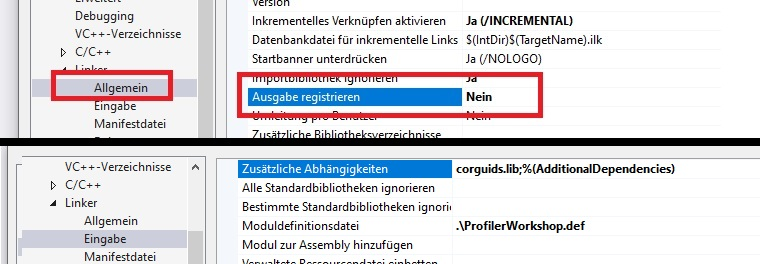

---
# Startprojekt
Änderungen an Dateien:
- **framework.h**: Füge `using namespace ATL;` am Ende der Datei hinzu
- **Resource.h**: Füge `#define IDR_PROFILER 102` ans Ende hinzu, `NewLine` nicht vergessen!
- **ProfilerWorkshop.cpp**: Lösche die Funktion `STDAPI DllInstall(BOOL bInstall, _In_opt_ LPCWSTR pszCmdLine)`.
- **ProfilerWorkshop.def**: Ersetze `LIBRARY` durch `LIBRARY "ProfilerWorkshop.dll"` und entferne die Zeile `DllInstall PRIVATE`
---

# Startprojekt
Hinzufügen neuer Dateien:
- `ProfilerWorkshop.idl` (Ersetzt die vorherige komplett) (von Github)
- `ProfilerCallback.h`  (von Github)
- jetzt einmal kompilieren, es sollten keine Fehler mehr auftauchen
- `ProfilerCallback.cpp` anlegen. (von Github)
- Nochmal kompilieren :-)

---
# Startprojekt
- Anlegen eines Testprogramms
- Konsolenapplikation (dotnet core), Version sollte egal sein
- Name "TestApp"
```
    namespace TestApp
    {
        public class Program
        {
            public static void Main()
            {
                Console.WriteLine("Hello, World!");
                Console.ReadKey();
            }
        }
    }
```

---

# Startprojekt

- **Any Cpu**:
    `anycpu (default) compiles your assembly to run on any platform. Your application runs as a 64-bit process whenever possible and falls back to 32-bit when only that mode is available.`
- Ungünstig! Deswegen -> Definition von festen Targets in TestApp
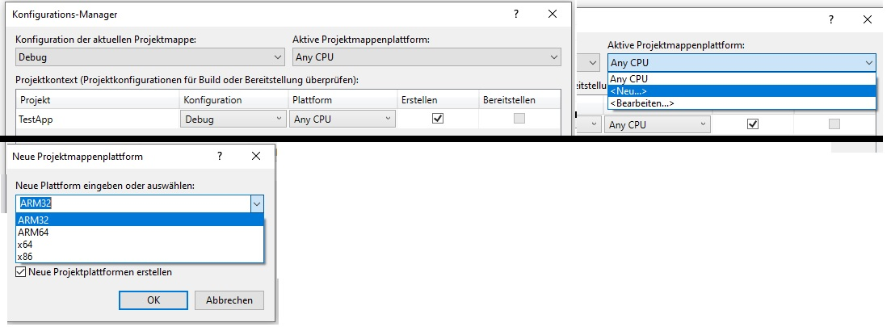

---

# Startprojekt
Profiler muss der TestApp bzw dotnet bekannt gemacht werden:
```
SET CORECLR_ENABLE_PROFILING=1
SET CORECLR_PROFILER={b45048d5-6f44-4fbe-ae88-b468a5e4927a}
SET CORECLR_PROFILER_PATH=ProfilerWorkshop/Debug/ProfilerWorkshop.dll
SET COMPLUS_ProfAPI_ProfilerCompatibilitySetting=EnableV2Profiler

START TestApp/TestApp/bin/x86/Debug/net6.0/TestApp.exe
```
Wichtig: Pfade anpassen, je nach `bitness`.
Und: Vorgehen für .Net Framework identisch, außer ENV Variablen

--- 

# Startprojekt
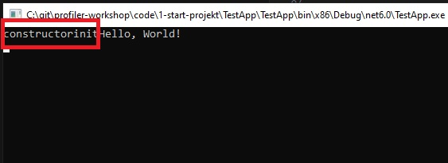

---

# Basiswissen

- Auslösender Thread ruft Profiler auf
- Threadsicherheit!
- Lifecycle **Initialize()**: Konfigurieren des Profilers
- **ICorProfilerInfo** Brücke zwischen Profiler und App
- Numerisches Suffix: ICorProfilerInfo2, ICorProfilerInfo3, ...

<!--
ICorProfilerInfo:
z.b. Abrufen des Methodennamens

Suffix: Je höher, desto aktueller die Version. 2er bietet ausreichend Möglichkeiten
-->

---

# Basiswissen - Initialize()
- Instanz vom Typ `ICorProfilerInfo` anfordern
- Per Flag die Events konfigurieren
- Hooks installieren

<!--
Einziger Ort, um den Profiler zu konfigurieren
-->

---

# Basiswissen - Änderung an ProfilerWorkshop.cpp
- **Live Coding** (mit Hilfestellung :-P)

---

# Profiler debuggen
- TestApp mit start.bat starten
- VS Debugger attachen (nativen Code)
- Breakpoints setzen

---

# Mehr Informationen rausholen

- Callbacks liefern nur IDs, da performanter
- Weitere Infos durch Methodenaufrufe
- `_CRT_SECURE_NO_WARNINGS` um `wcstombs()` nutzen zu können
- für x86 und x64!
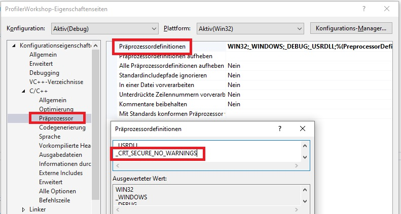
---

# Mehr Infos - Bsp GetClassNameByObjectId
- **Livecoding**

**Nützlich:**
```
iCorProfilerInfo->GetClassFromObject
iCorProfilerInfo->GetClassIDInfo
iCorProfilerInfo->GetModuleMetaData
metadata->GetTypeDefProps
memset & wcstombs
```

---

# Exkurs: Stack

- Speicher für lokale Variablen, Sicherungen des aktuellen Callframes, etc
- Stack wächst von oben nach unten
- `PUSH` reduziert `SP` und legt Wert ab nach `[SP]`

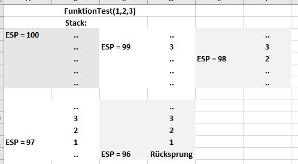

---

# Exkurs: Register

- CPU Register sind Speicherbereiche mit äußerst kurzen Zugriffszeiten
- die bekanntesten: (E)AX, (E)BX, (E)CX, (E)DX, (E)SP, (E)IP
- E = `Extended` => 32 Bit
- AX = 16 Bit
- AL = 8 Bit
- AH = 8 Bit
- 64 Bit Register: RAX

---

# Exkurs: Calling Convention

- Beschreibt, wie Funktionen aufgerufen werden
- wie werden Parameter übergeben
- wie wird `this` übergeben
- wo landet ein Rückgabewert
- wer kümmert sich um Register und Stack

---

# Exkurs: Epilog und Prolog

- Compiler erstellt Epilog und Prolog
- Compiler sichert Register am Anfang
- Compiler räumt Stack auf
- Stellt Register wieder her
- Abhängig von Calling Convention!
- All das passiert mit `declspec(naked)` nicht
- Man ist selbst verantwortlich dafür

---

# Exkurs: Epilog und Prolog

---

**Prolog:** Wenige Zeilen Code am Anfang einer Funktion um Stack und Register vorzubereiten.

**Epilog:** Wenige Zeilen am Ende einer Funktion, um Stack und Register wieder auf den vorherigen Zustand zu bringen.

---

# Exkurs: Calling Convention - cdecl

- Parameter werden v.r.n.l. gepusht
- Funktion entfernt Pareameter nicht von Stack

---

# Exkurs: Calling Convention - stdcall

- Parameter werden v.r.n.l. gepusht
- Funktion entfernt Parameter von Stack

---

# Exkurs: Fastcall

- Dotnet nutzt Fastcall
- Parameter werden in 64 Bit Apps u.A. v.l.n.r. in den Registern RCX, RDX, R8, R9 abgelegt
- `this` Pointer in RCX, da erster Parameter einer Funktion

---

# Exkurs: Endianess

- Bytereihenfolge
- Big Endian: "Wert steht so da wie man ihn liest"
- Little Endian: "Rückwärts"
- Bsp: 0x1020304050 (BE)
- Liegt so im Speicher (LE): 50 40 30 20 10

---

# Exkurs: Epilog, Calling Convention, Register - Demo

- Demo (EpilogProlog -> stack, declspec(naked))
- Demo (StdCallConvention.sln -> Stack, StdCall)
- Demo (Dlltest -> Endianess, Register, cdecl/stdcall Auswirkung, )

<!--
__declspec(naked) int __cdecl ....
__asm { ret }

- das Gleiche ohne naked
- Kompilieren mit DEBUG und ASM Code anschauen
- oder Debuggen & Assembly

-------------
Registerbeispiel: mit x64 kompilieren
------
-->

---

# Exkurs: Aufrufen von C++ Funktion aus Assembler
- Vereinfacht viele Sachen

---

# FunctionEnter/Leave 32 Bit

- Flag: `COR_PRF_MONITOR_ENTERLEAVE`
- Werden als Hook installiert
- `ICorProfilerInfo.SetEnterLeaveFunctionHooks2` -> Nur in Initialize() möglich!

---

# FunctionEnter/Leave 32 Bit - Wichtig

The `FunctionEnter2` function is a callback; you must implement it. The implementation must use the `__declspec(naked)` storage-class attribute.

The execution engine does `not save any registers before calling this function`.

On entry, you must save `all registers that you use`, including those in the floating-point unit (FPU).

On exit, you must `restore the stack by popping off` all the parameters that were pushed by its caller.

---

# FunctionEnter/Leave 32 Bit - Wichtig

The implementation of `FunctionEnter2` should `not block` because it will delay garbage collection.
The implementation should `not attempt a garbage collection` because the stack may not be in a 
garbage collection-friendly state. 
If a garbage collection is attempted, the runtime will block until FunctionEnter2 returns.

Also, the FunctionEnter2 function must `not call into managed code` or in any way cause a managed memory allocation.

---

# FunctionEnter/Leave 32 Bit
**Grundkonstrukt:**

```
HRESULT __stdcall ProfilerCallback::Initialize(IUnknown* pICorProfilerInfoUnk)
{
//...
iCorProfilerInfo->SetEnterLeaveFunctionHooks2((FunctionEnter2*) & FnEnterCallback, (FunctionLeave2*) & FnLeaveCallback, (FunctionTailcall2*) & FnTailcallCallback);
//...
}
```

---

```
void __declspec(naked) FnEnterCallback(
	FunctionID funcId,
	UINT_PTR clientData,
	COR_PRF_FRAME_INFO func,
	COR_PRF_FUNCTION_ARGUMENT_INFO* argumentInfo) {
	__asm {
		ret 16
	}
}

void __declspec(naked) FnLeaveCallback(
	FunctionID funcId,
	UINT_PTR clientData,
	COR_PRF_FRAME_INFO func,
	COR_PRF_FUNCTION_ARGUMENT_INFO* argumentInfo) {
	__asm {
		ret 16
	}
}

void __declspec(naked) FnTailcallCallback(FunctionID funcId,
	UINT_PTR clientData,
	COR_PRF_FRAME_INFO func) {
	__asm {
		ret 8
	}
}
```

---

# FunctionEnter/Leave - Funktionsnamen auslesen

```
bool GetFunctionNameByFunctionId(FunctionID functionId, char* output, ULONG outputLength) {
IMetaDataImport* metadata;
mdMethodDef methodToken;
mdTypeDef typeDefToken;
wchar_t* functionName = new wchar_t[1000];
ULONG wcbCount;
memset(functionName, 0, 1000);

iCorProfilerInfo->GetTokenAndMetaDataFromFunction(functionId, IID_IMetaDataImport, (IUnknown**)&metadata, &methodToken);
metadata->GetMethodProps(methodToken, &typeDefToken, functionName, 1000, &wcbCount, NULL, NULL, NULL, NULL, NULL);
wcstombs(output, functionName, outputLength);
metadata->Release();
delete[] functionName;

return true;
}
```

--- 

# FunctionEnter/Leave - CPP Funktion aufrufen

```
void __declspec(naked) FnEnterCallback(
	FunctionID funcId,
	UINT_PTR clientData,
	COR_PRF_FRAME_INFO func,
	COR_PRF_FUNCTION_ARGUMENT_INFO* argumentInfo) {
	__asm {
		push dword ptr[ESP + 16]
		push dword ptr[ESP + 16]
		push dword ptr[ESP + 16]
		push dword ptr[ESP + 16]
		CALL EnterCallbackCpp

		ret 16
	}
}
```

---

# FunctionEnter/Leave - Funktionsnamen ausgeben

```
void __stdcall EnterCallbackCpp(FunctionID funcId,
	UINT_PTR clientData,
	COR_PRF_FRAME_INFO func,
	COR_PRF_FUNCTION_ARGUMENT_INFO* argumentInfo) {
	char* output = new char[1000];
	memset(output, 0, 1000);

	GetFunctionNameByFunctionId(funcId, output, 1000);

	std::cout << "Function enter: " << output << "\r\n";

	delete[] output;
}
```

---

# FunctionEnter/Leave - 64 Bit
- VS unterstützt bei 64Bit Kompilaten kein inline Assembler
- stattdessen: externe .asm Datei + MASM
- wichtig: `extern c` bei Funktionsdeklaration

---

# FunctionEnter/Leave - 64 Bit - MASM
- Datei anlegen mit `.asm` Endung
- `Projekteinstellungen` > `Buildabhängigkeiten` 
- `masm` auswählen

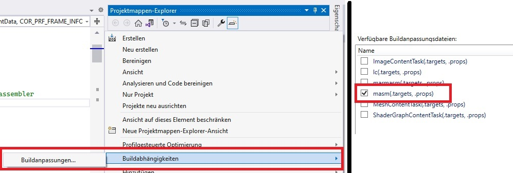

---

# FunctionEnter/Leave - 64 Bit - MASM
- Einstellungen der `.asm` Datei öffnen
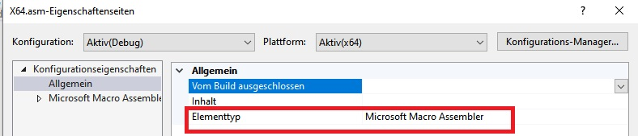

---

# FunctionEnter/Leave - 64 Bit - fastcall
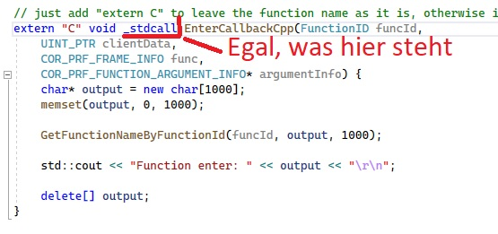

---

# FunctionEnter/Leave - 64 Bit
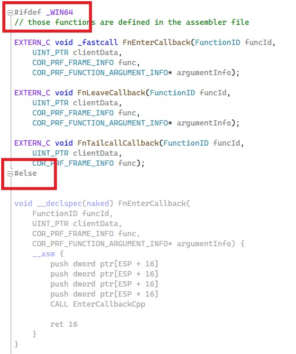

---

# Funktionsparameter auslesen
```
        public static void Main()
        {
            Console.ReadKey();
            Blub_i(1);
            Blub_arr(new []{1,2,3,4,5,6});
            Blub_str("Hello, World");
            Console.ReadKey();
        }

        public static void Blub_i(int i)
        {
            Console.WriteLine(i);
        }

        public static void Blub_str(string str)
        {
            Console.WriteLine(str);
        }

        public static void Blub_arr(int[] intArray)
        {
            Console.WriteLine(intArray.Length);
        }
```

---

# Funktionsparameter auslesen - COR_PRF_ENABLE_FUNCTION_ARGS
`iCorProfilerInfo->SetEventMask(COR_PRF_MONITOR_EXCEPTIONS | COR_PRF_MONITOR_ENTERLEAVE | COR_PRF_ENABLE_FUNCTION_ARGS);`

---

# Funktionsparameter auslesen

- `COR_PRF_FUNCTION_ARGUMENT_INFO* argumentInfo` 
- struct welche Speicherblöcke mit Parametern beschreibt
- `argumentInfo->numRanges` Anzahl solcher Blöcke
- `argumentInfo->ranges` Array an Daten

In unserem Beispiel einfach: Nur ein Parameter

`argumentInfo->ranges[0].startAddress`

---

# Funktionsparameter auslesen - Startaddress

- `startAddress` Bedeutung abhängig von Parametertyp
- value Type: Pointer zu Wert
- object: Pointer auf Pointer zu Method Table Pointer
- struct: Pointer zu struct

---

# Funktionsparameter auslesen - Repräsentation der Daten 

**Um die Daten interpretieren** zu könnn, muss man wissen, wie die Daten im Speicher aussehen. Wie kommt man an diese Info?

- Bücher lesen
- Microsoft fragen :-P
- Oder einfach Debuggen

Hierzu:
`fastcall`: Parameter landen v.l.n.r in `RCX, RDX, R8, R9`

<!--
static void Main(string[] args)
{
    IntArrayFn(new int[] { 1,2,3,4,5,6,7,8,9,10});
}

static void IntArrayFn(int[] intArray)
{
    // place a breakpoint here and leave the method empty
}

- Adresse von intArray holen (RCX, da static)
- in Speicher schauen
- MT, Array Length, Data
-->
---

# Funktionsparameter auslesen - Code

Siehe Code

---

# Stackoverflow erkennen

Siehe Code

---

# Ende

